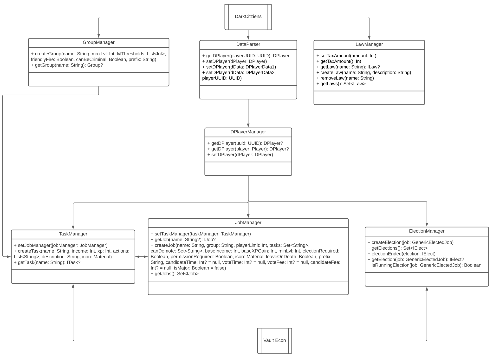

# DarkCitizens

## What is this supposed to do?
DarkRP is a game mode in Garry's Mod. It lets players join the server, become a citizen of a fictional city and take a job. Jobs are typically the following:

- Mayor: Decides the laws of the city and sets taxes for jobs. Upon death, an election is triggered for the job of Mayor. Players can pay $XXX to take part in the election.
- Police officer/Government jobs: Protects the city from criminals. Can raid peoples properties if found doing illegal activity and arrest people, sending them to jail.
- Mobster: Illegally prints money, can mug people, can raid rival mobsters, can kill the mayor if the laws are too much/taxes are too high, rob the bank.
- Doctor: Heals people for money
- Baker: Can spawn in a bakery factory and cook bread to sell
- Miner: Can mine ores and sell them for money

## How the Project is designed

As you can see here DarkCitizens uses so-called Managers. These Managers provide further access too certain functionalities. 
If you want to create a new Job for example you have to use
the JobManager.createJob function. If you want to retrieve this job again from the manager just use its name.
If you want to write an extension Plugin for DarkCitizens you can just get all the managers from the Main Class
DarkCitizens, where they are registered as static properties.

## How do I get closer info to a class?
Whenever changes are pushed to the Repo a new Documentation will be generated using Dokka, the link to the Docs will be smth like this:
`https://recraftedcivilizations.github.io/Projects/RecraftedCivilizations/DarkCitizens/docs/1.0-SNAPSHOT/-dark-citizens/index.html`
Just Replace the `1.0-SNAPSHOT` with the version you are interested in.
If you don't want to use the generated version, or you can't access it for some reason you can generate it for yourself.
To do that just clone the project and type `./gradlew dokkaHtml`, then you can find your generated Docs in your build
directory.

## What if I have further questions, and I don't want to spend hours to find the answer?
Just create an Issue on GitHub, write me an email at `darkvanity.oflight@gmail.com` or a Discord message `DarkVanityOfLight#8817`